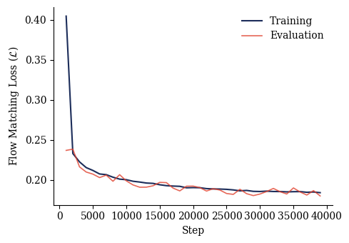
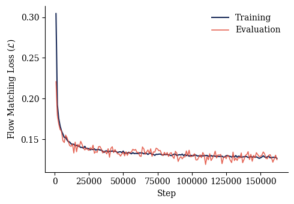

# Flow Matching Reimplementation [Lipman et al., 2022](https://doi.org/10.48550/arXiv.2210.02747) in JAX

### Performance Metrics

| Dataset | Steps | Final Train Loss | Final Eval Loss |
| :--- | :--- | :--- | :--- |
| **CIFAR-10** | $39000$ | $0.1843$ | $0.1802$ |
| **CelebA** | $162000$ | $0.1266$ | $0.1250$ |

### Convergence Visualizations

#### CIFAR-10 Training Profile
<figure>
  
  <figcaption align="center"><b>Figure 1:</b> CIFAR-10 Training Profile.</figcaption>
</figure>

<br>

#### CelebA Training Profile
<figure>
  
  <figcaption align="center"><b>Figure 2:</b> CelebA Training Profile.</figcaption>
</figure>

## Hyperparameters

Configurations are managed via `src/hyperparameters.yaml`.

| Parameter | CIFAR-10 | CelebA |
| :--- | :--- | :--- |
| **Image Resolution**| $32 \times 32$| $64 \times 64$|
| **Encoder Features**| $[32, 64, 128]$| $[64, 128, 256]$|
| **Time Embedding Features**| $128$| $256$|
| **Learning Rate** | $0.001$ | $0.0005$ |
| **Batch Size** | $32$ | $64$ |
| **Steps** | $39100$ | $162800$ |

---


## Getting Started

### Installation
This project uses `uv` for dependency management. Clone the parent repository and navigate to the project directory:

```bash
git clone https://github.com/KajetanFrackowiak/MiniProjectsComputerVision.git
cd MiniProjectsComputerVision/VAE
uv sync

