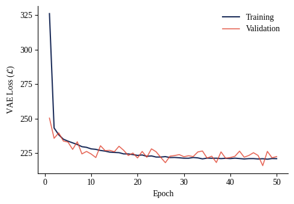
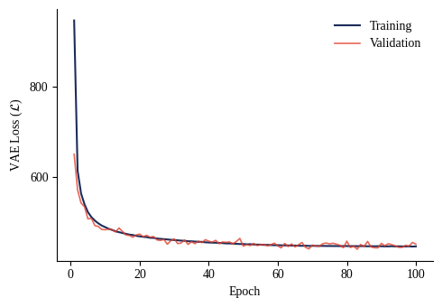

# Variational Auto-Encoder (VAE) Reimplementation

A clean, modular PyTorch implementation of the **Variational Auto-Encoder (VAE)** as proposed by Kingma and Welling in ["Auto-Encoding Variational Bayes"](https://arxiv.org/abs/1312.6114).

This repository evaluates the generative and reconstructive capabilities of VAEs on the **CIFAR-10** and **CelebA** datasets.

## Architecture & Objective

The model maximizes the **Evidence Lower Bound (ELBO)**, which consists of a reconstruction term and a regularization term:

$$\mathcal{L}(\theta, \phi; \mathbf{x}) = \mathbb{E}_{q_\phi(\mathbf{z}|\mathbf{x})}[\log p_\theta(\mathbf{x}|\mathbf{z})] - D_{KL}(q_\phi(\mathbf{z}|\mathbf{x}) || p_\theta(\mathbf{z}))$$

- **Encoder:** Convolutional layers mapping inputs to the latent distribution parameters ($\mu, \sigma$).
- **Bottleneck:** The reparameterization trick $z = \mu + \sigma \odot \epsilon$ where $\epsilon \sim \mathcal{N}(0, I)$.
- **Decoder:** Transposed convolutions to map the latent vector $z$ back to the original image space.

---

## Results

Quantitative results demonstrate stable convergence. Note that CelebA shows a higher absolute loss due to its higher dimensionality ($64 \times 64 \times 3$) compared to CIFAR-10 ($32 \times 32 \times 3$).

### Performance Metrics

| Dataset | Epochs | Final Train Loss | Final Val Loss | Test Loss |
| :--- | :--- | :--- | :--- | :--- |
| **CIFAR-10** | 50 | 220.94 | 222.44 | **224.08** |
| **CelebA** | 100 | 445.06 | 449.99 | **443.62** |

### Convergence Visualizations

#### CIFAR-10 Training Profile

*Figure 1: The model reaches a stable plateau by epoch 20 with minimal generalization gap.*

#### CelebA Training Profile

*Figure 2: Steady convergence over 100 epochs. The higher loss is a function of the increased pixel count.*

---

## Hyperparameters

Configurations are managed via `src/hyperparameters.yaml`.

| Parameter | CIFAR-10 | CelebA |
| :--- | :--- | :--- |
| **Learning Rate** | 0.001 | 0.0005 |
| **Batch Size** | 64 | 128 |
| **Epochs** | 50 | 100 |
| **Latent Dim** | 128 | 256 |

---

## Getting Started

### Installation
This project uses `uv` for dependency management. Clone the parent repository and navigate to the project directory:

```bash
git clone https://github.com/KajetanFrackowiak/MiniProjectsComputerVision.git
cd MiniProjectsComputerVision/VAE
uv sync

Reproducing Results
To train the model using the provided configs:

# CIFAR-10
python src/train.py --dataset uoft-cs/cifar10

# CelebA
python src/train.py --dataset flwrlabs/celeba
