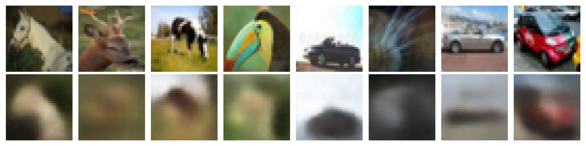
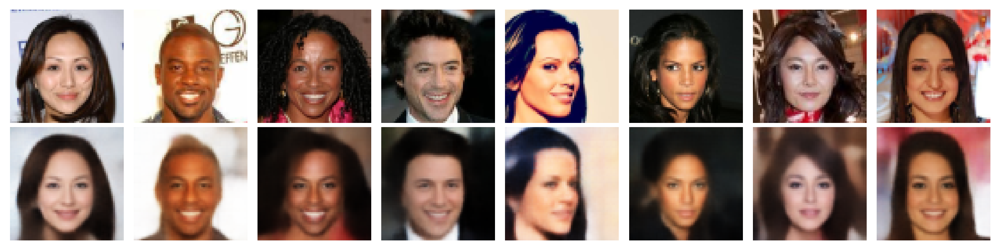

# Variational Auto-Encoder Reimplementation [Kingma & Welling, 2013](https://arxiv.org/abs/1312.6114) in JAX

### Performance Metrics

| Dataset | Epochs | Final Train Loss | Final Val Loss | Test Loss |
| :--- | :--- | :--- | :--- | :--- |
| **CIFAR-10** | $50$ | $220.94$ | $222.44$ | $\textbf{224.08}$ |
| **CelebA** | $100$ | $445.06$ | $449.99$ | $\textbf{443.62}$ |

### Convergence Visualizations

#### CIFAR-10 Training Profile
<figure>
  
  <figcaption align="center"><b>Figure 1:</b> CIFAR-10 Training Profile.</figcaption>
</figure>

<br>

#### CelebA Training Profile
<figure>
  
  <figcaption align="center"><b>Figure 2:</b> CelebA Training Profile.</figcaption>
</figure>


### Reconstruction Visualizations

<figure>
    
    <figcaption align="center"><b>Figure 3:</b> CIFAR-10 Visualization Profile.</figcaption>
</figure>

<br>

<figure>
    
    <figcaption align="center"><b>Figure 4:</b> CelebA Visualization Profile.</figcaption>
</figure>

---

## Hyperparameters

Configurations are managed via `src/hyperparameters.yaml`.

| Parameter | CIFAR-10 | CelebA |
| :--- | :--- | :--- |
| **Image Resolution**| $32 \times 32$| $64 \times 64$|
| **Latent Dimension**| $20$ | $128$ |
| **Encoder Features**| $[32, 64, 128]$| $[32, 64, 128, 256]$|
| **Learning Rate** | $0.001$ | $0.0005$ |
| **Batch Size** | $64$ | $128$ |
| **Epochs** | $50$ | $100$ |
| **Latent Dim** | $128$ | $256$ |

---

## Getting Started

### Installation
This project uses `uv` for dependency management. Clone the parent repository and navigate to the project directory:

```bash
git clone https://github.com/KajetanFrackowiak/MiniProjectsComputerVision.git
cd MiniProjectsComputerVision/VAE
uv sync

